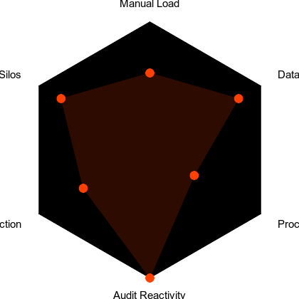

# Differentiation & Moat

## Diagnostic Scoring Framework

NeatAudit is SrvdNeat's proprietary AI readiness diagnostic, specifically designed for SMEs. It features:

- A rapid 5-minute digital intake process, requiring no account setup or technical jargon
- Structure around six universal friction dimensions
- Each dimension is scored on a 1–5 severity scale, weighted by its impact and prevalence
- The output includes an Aggregate Friction Score (AFS), prioritized use cases, and an ROI-weighted intervention path

### Scoring Framework

| **Dimension** | **Scoring Criteria (1–5 scale)** |
|---------------|----------------------------------|
| Manual Load | Volume of repeatable, low-value tasks |
| Data Fragmentation | Number of disconnected systems + manual handoffs |
| Process Opacity | Lack of visibility, SOPs, or automation triggers |
| Audit Reactivity | Time spent reacting to compliance/client demands |
| Scalability Friction | Workflows dependent on individuals, not systems |
| Knowledge Silos | Critical information not captured, structured, or shared |

Scores are dynamically weighted based on industry, organizational size, and digital maturity.

### Sample Questions by Category

- **Manual Load:** "How often do you enter the same data into multiple systems (e.g., Xero + CRM + Email)? What % of your team's time is spent on repeatable tasks?"
- **Data Fragmentation:** "How many software tools do you actively use to manage operations? Do these tools sync automatically or require manual updates?"
- **Process Opacity:** "Can you describe your workflow for onboarding a new client? Who owns each step, and is that documented?"

Each question is presented in plain English, is role-specific, and designed to extract genuine friction points rather than vague pain points.

## Friction Index & ROI Mapping

Sample Range: 1 = Minimal Friction, 5 = Critical Barrier)

| **Dimension** | **Example (Legal SME)** | **Score** |
|---------------|-------------------------|-----------|
| Manual Load | Intake forms retyped from PDFs | 4.5 |
| Data Fragmentation | Client docs in Dropbox, billing in LEAP | 4.2 |
| Process Opacity | No automated handoff from email to billing | 3.8 |
| Audit Reactivity | Compliance flagged late via email chains | 4.0 |
| Scalability Friction | Principal manually approves every document | 4.6 |
| Knowledge Silos | No shared SOPs; "we ask Sarah" for everything | 5.0 |

**Aggregate Friction Score: 4.35**
**Recommendation:** Immediate orchestration of onboarding, billing, and approval workflows.

<!-- Friction Radar Chart -->

## Pattern Memory & Adaptive Execution

Upon completion of an audit, NeatLM generates a tailored solution path. For instance:

**Input:** AFS = 4.3 | High admin in manual load, silos, billing

**Output:**
- Deploy agent to extract onboarding info from email → sync with CRM
- Auto-generate client engagement letter → trigger billing setup
- Centralize SOPs and workflows inside NeatPortal for team access

**Time-to-value:** 24–48 hours
**Projected ROI:** 270% in the first 90 days

## Behavioral Data Moat

Our defensibility is rooted in pattern density, not merely intellectual property. This is achieved through:

- **NeatAudit Fingerprint:** Each NeatAudit generates a unique fingerprint of how SMEs operate
- **Friction Cluster Identification:** NeatLM leverages this data to identify friction clusters across various industries
- **Smarter Interventions:** Interventions become increasingly intelligent with each rollout
- **Continuously Tuned Playbooks:** Playbooks are templated but are continuously fine-tuned for each segment

## Learning Flywheel & Long-Term Defensibility

As our client base expands, we compound three distinct advantages:

- **Pattern Density:** Every audit refines our understanding of SME friction, leading to the evolution of segment-specific playbooks derived from real-world data
- **Instruction Optimization:** Our agents continuously improve their execution across various use cases, not just within individual companies. This reduces deployment effort and error rates
- **Predictive Intervention:** Friction signatures enable preemptive solution nudges. For example, a system prompt might alert a user: "You're about to hit a billing bottleneck—would you like suggested paths forward?"

We are not merely adding features; we are systematically upgrading the SME nervous system, one workflow at a time. 